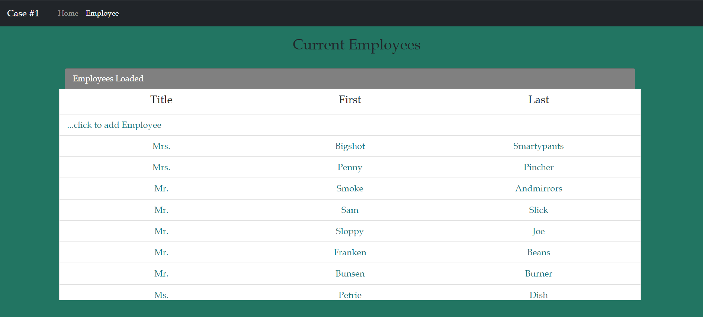
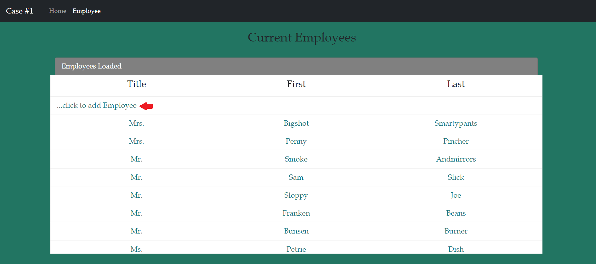
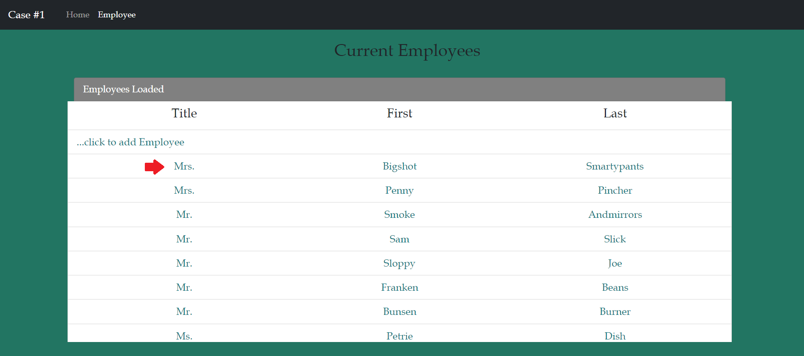
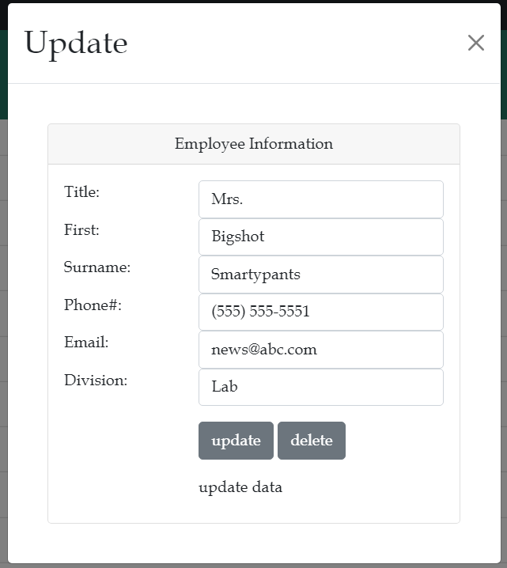

# Employee Manager

A client/server application made with MVC architecture (5 logical tiers). The web application uses API Controller (RESTful services) to communicate with the 
ViewModel objects by using HTTP methods.

MVC architecture consists of 5 logical tiers:
1. Presentation layer: Web pages (HTML, JavaScript/jQuery, CSS, Bootstrap5)
2. Business layer: 
	i. Web API Controllers (C#) - Website
	ii. ViewModel Objects (C#) - DLL
	iii. Domain and Data Access Objects (C#) - DLL
3. Data layer: SQL Server localDb (https://raw.githubusercontent.com/elauersen/info3070/master/casestudySQL.txt)

## Some key features
- Gets a list of employees from the database and shows it in a form of table when landing on the webpage (/employee.html).

- Add a new employee.

- Update an existing employee by tapping on top of the record.

- Delete an employee.

